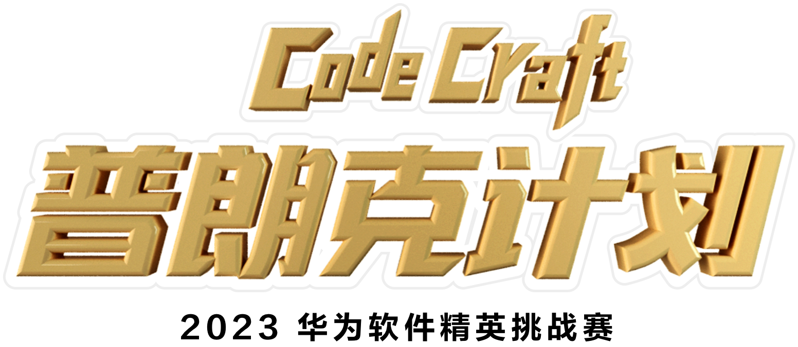

# 2023 华为软件精英挑战赛

**基于张元龙老师实现的多机器人协同调度方案探索与实践**

---

## 比赛简介

2023 华为软件精英挑战赛以「**机器人协同调度**」为核心命题。参赛队伍需要编写策略代码，控制多台机器人在复杂地图中完成原料采购、产品制造和商品出售等任务，在限时条件下最大化收益。

本仓库基于华为官方提供的 **张元龙老师示例代码**（SimpleDemo），对其核心算法进行了深入学习与分析，并在路径规划、任务分配、冲突解决等关键环节进行了探索性优化。

> 更多背景可参考华为云论坛：[2023华为软件精英挑战赛代码解析](https://bbs.huaweicloud.com/forum/thread-0232118049695936048-1-1.html)

---

## 参考资料

- [华为云论坛 - 2023软件精英挑战赛代码解析](https://bbs.huaweicloud.com/forum/thread-0232118049695936048-1-1.html)
- 原始代码版权归 **华为技术有限公司** (2019-2023)

---

## 许可

原始代码版权 © 2019-2023 Huawei Technologies Co., Ltd. 本仓库仅供学习交流使用。
