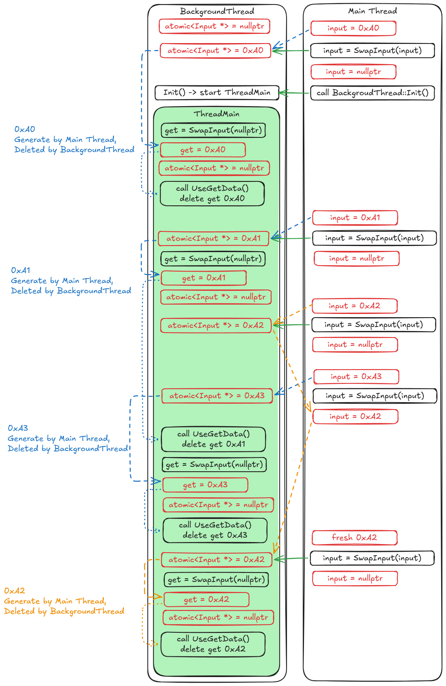

# C++ `<atomic>` 库入门 —— 从项目代码出发

> 基于本仓库 `BackgroundThread` 中的实际用法展开

---

## 一、先看代码：两行关键声明

```cpp
// BackgroundThread.h:103 — 成员变量声明
std::atomic<Input *> m_lidarInput{nullptr};

// BackgroundThread.h:60-63 — 成员函数
Input *SwapInput(Input *input)
{
    return std::atomic_exchange(&m_lidarInput, input);
}
```

**`std::atomic<Input *>` 是什么？**
它把一个**普通裸指针** `Input *` 包装成了"原子指针"。这里的关键是：**被包装的是指针本身（8 字节地址值），不是指针指向的对象**。

```
内存视角：

  m_lidarInput                Input 对象
  ┌──────────────┐            ┌─────────────────┐
  │  0x7f...a0   │ ────────► │ pos, angle, ... │
  └──────────────┘            └─────────────────┘
   ↑                          ↑
   原子操作保护这个地址值       对象内容不受 atomic 保护
```



---

## 二、3 分钟理解 CPU 原子操作

### 2.1 为什么需要 `atomic`？

普通赋值 `ptr = new_value` 在多线程下**不保证可见性**：

```
线程 A:  ptr = 0x1234;          // store
线程 B:  if (ptr) { ... }       // load

问题：线程 B 可能永远看不到 0x1234（CPU 缓存在寄存器里）
      或者看到"半个指针"（在某些 32 位平台上指针是 64 位）
```

`std::atomic` 强制每次读写都穿透 CPU 缓存，且保证操作不可分割。

### 2.2 x86-64 上的免费午餐

好消息：**x86-64 平台上，指针大小的 aligned load/store 本身就是原子的**。
`std::atomic<Input *>` 在 x86-64 上编译出来就是普通的 `mov` 指令，零额外开销，完全无锁。

```asm
// std::atomic_exchange(&m_lidarInput, input) 编译为：
xchg    rax, [m_lidarInput]    // 一条 CPU 指令完成交换
```

---

## 三、`atomic_exchange` 逐行拆解

```cpp
return std::atomic_exchange(&m_lidarInput, input);
```

| 组成部分 | 含义 |
|----------|------|
| `&m_lidarInput` | 要操作的原子变量的地址 |
| `input` | 要写入的新值 |
| **返回** `Input *` | 写入前该原子变量的**旧值** |
| **效果** | 新值写入 + 旧值返回，整个过程**不可分割** |

### 等价伪代码（有锁版本便于理解）：

```cpp
Input *SwapInput_locked(Input *input) {
    m_lock.lock();
    Input *old = m_lidarInput;    // 记住旧值
    m_lidarInput = input;         // 写入新值
    m_lock.unlock();
    return old;                   // 返回旧值
}
```

### 在项目中的实际运行轨迹：

```
时间 →

主线程 Frame 1:
  ① 创建 Input_A, 地址 0xA000
  ② SwapInput(0xA000)
     → m_lidarInput 旧值 = nullptr
     → m_lidarInput 新值 = 0xA000
     → 返回 nullptr

后台线程:
  ③ SwapInput(nullptr)
     → m_lidarInput 旧值 = 0xA000  ← 拿到了！
     → m_lidarInput 新值 = nullptr
     → 返回 0xA000，开始处理 Input_A

主线程 Frame 2:
  ④ 创建 Input_B, 地址 0xB000
  ⑤ SwapInput(0xB000)
     → m_lidarInput 旧值 = nullptr  (后台已经取走了)
     → m_lidarInput 新值 = 0xB000
     → 返回 nullptr
```

**核心技巧**：主线程用 `SwapInput(input)` 写新指针，后台用 `SwapInput(nullptr)` 读指针。
同一个函数，参数含义不同时扮演**推送**或**拉取**两个角色。

---

## 四、`<atomic>` 常用操作速查

以下按使用频率排列，`T` 可以是 `int`、`bool`、`T*` 等。

### 4.1 读 / 写（load / store）

```cpp
std::atomic<int> ready{0};

// 原子写入
ready.store(1);
// 等价于 ready = 1，但保证其他线程可见

// 原子读取
int v = ready.load();
// 等价于 int v = ready，但保证读到最新值
```

**与本项目的对应**：`m_exited` 用 `bool`（非 atomic），主线程写、后台线程读，严格来说不保证可见性，但这在该项目里几乎不会出问题（因为后台线程在 `sleep_for` 后总会重新检查）。

### 4.2 交换（exchange）

```cpp
std::atomic<int> counter{42};

int old = counter.exchange(100);
// 等价于 std::atomic_exchange(&counter, 100)
// old = 42, counter = 100
```

**就是本项目 `SwapInput` 用的操作**。无等待、一条 CPU 指令。

### 4.3 条件交换（compare_exchange_strong / compare_exchange_weak）

**这是 `<atomic>` 里最重要的操作，无锁数据结构的基础。**

```cpp
std::atomic<int> val{0};

int expected = 0;
int desired  = 1;

// 如果 val 当前值 == expected，则写入 desired，返回 true
// 否则将 val 当前值写入 expected，返回 false
if (val.compare_exchange_strong(expected, desired)) {
    // 成功：val 从 0 变成了 1
} else {
    // 失败：val 不是 0，expected 被更新为 val 的实际值
}
```

**典型用法**：无锁的"试图占有"模式

```cpp
std::atomic<bool> locked{false};

bool try_lock() {
    bool expected = false;
    return locked.compare_exchange_strong(expected, true);
    // 只有 locked == false 时才成功设为 true
}

void unlock() {
    locked.store(false);
}
```

**strong vs weak**：
- `strong`：只在值确实不同时才失败（推荐用于简单场景）
- `weak`：可能"伪失败"（spurious failure），必须放在循环里用，但某些平台上更快

### 4.4 原子算术（fetch_add / fetch_sub）

```cpp
std::atomic<int> seq{0};

int my_seq = seq.fetch_add(1);  // 返回旧值，然后 +1
// my_seq = 0, seq = 1

// 支持的操作：
seq.fetch_add(5);    // +=
seq.fetch_sub(3);    // -=
seq.fetch_and(0xFF); // &=
seq.fetch_or(0x80);  // |=
seq.fetch_xor(0x0F); // ^=
seq++;               // 也是原子的（等价于 fetch_add(1)）
```

### 4.5 检查是否无锁（is_lock_free）

```cpp
std::atomic<Input *> ptr;
if (ptr.is_lock_free()) {
    // x86-64 上指针总是 true，一条 CPU 指令
}
```

在 x86-64 上：`int`、`bool`、`T*`、`size_t` 都是 lock-free。
大的 struct（超过 16 字节）可能不是，内部会用 mutex 模拟。

---

## 五、操作对比：什么时候用什么

| 操作 | 读旧值 | 写新值 | 典型场景 |
|------|--------|--------|----------|
| `load()` | ✔️ | — | 只读一个标志位 |
| `store()` | — | ✔️ | 只写一个标志位 |
| `exchange()` | ✔️ | ✔️ | 交换指针（本项目）、替换状态 |
| `compare_exchange` | ✔️ | 条件✔️ | 无锁队列、无锁栈、自旋锁 |
| `fetch_add()` | ✔️ | ✔️ | 计数器、ID 分配器 |

---

## 六、内存序（`memory_order`）—— 可跳过，但了解更好

所有原子操作都可以带一个内存序参数：

```cpp
m_lidarInput.load(std::memory_order_acquire);  // 读屏障
m_lidarInput.store(ptr, std::memory_order_release); // 写屏障
```

如果**不指定**，默认是 `memory_order_seq_cst`（最强一致性，也是最安全、最慢的）。

| memory_order | 编译器重排 | CPU 重排 | 开销 (x86) |
|--------------|-----------|----------|------------|
| `relaxed` | 允许 | 允许 | 零 |
| `acquire` | 禁止向前 | 禁止向前 | 零（x86 固有） |
| `release` | 禁止向后 | 禁止向后 | 零（x86 固有） |
| `seq_cst` | 全面禁止 | 全面禁止 | ~1 个 mfence |

**实用建议**：初学阶段一律用默认（`seq_cst`），代码正确之后再考虑优化。
本项目的 `atomic_exchange` 用的也是默认序，完全没问题。

---

## 七、回到项目：这个设计为什么好

```cpp
// 声明
std::atomic<Input *> m_lidarInput{nullptr};

// 两个线程各调用各的
主线程:    SwapInput(新指针)      → 返回旧指针（或 nullptr）
后台线程:  SwapInput(nullptr)    → 返回主线程投递的指针（或 nullptr）
```

**优点一览**：

1. **零阻塞**：`atomic_exchange` 永不等待，主线程绝不会因后台慢而卡住
2. **单指针深度**：永远只有 0 或 1 个 Input 在队列中，新的会覆盖旧的
3. **所有权清晰**：`SwapInput` 调用后，调用方拥有返回的指针，被调用方拥有传入的指针
4. **内存安全**：后台线程总是 `delete` 它取到的指针；主线程复用被退回的旧指针时直接覆写

这就是 **无锁 SPSC（Single Producer Single Consumer）** 的最简单形态 —— 容量为 1 的无锁队列。

---

## 八、延伸：如果要支持多个 Input 不丢失怎么办

当前设计：新 Input 会**覆盖**未消费的旧 Input（适合实时系统，旧的没意义）。

如果要改成**不丢失**，可以扩容为无锁环形队列：

```cpp
std::atomic<Input *> ring_buf[256];
std::atomic<int> write_idx{0};
std::atomic<int> read_idx{0};

// 生产者
void push(Input *p) {
    int w = write_idx.load();
    int r = read_idx.load();
    if ((w + 1) % 256 != r) {     // 队列未满
        ring_buf[w] = p;
        write_idx.store((w + 1) % 256);
    }
    // 满了就丢弃（或阻塞）
}

// 消费者
Input *pop() {
    int r = read_idx.load();
    if (r == write_idx.load()) return nullptr;  // 空
    Input *p = ring_buf[r];
    read_idx.store((r + 1) % 256);
    return p;
}
```

> 需要配合 `memory_order` 微调才能完全正确，这是进阶话题。

---

## 九、推荐学习路径

1. **先会用**：`load` / `store` / `exchange`，对应本项目实际代码
2. **再理解**：`compare_exchange_strong`，写一个无锁计数器或自旋锁练手
3. **最后学**：`memory_order`，阅读 [cppreference.com](https://en.cppreference.com/w/cpp/atomic/memory_order) 和 Herb Sutter 的演讲

> 本文档可作为项目组内 `atomic` 培训材料使用。
